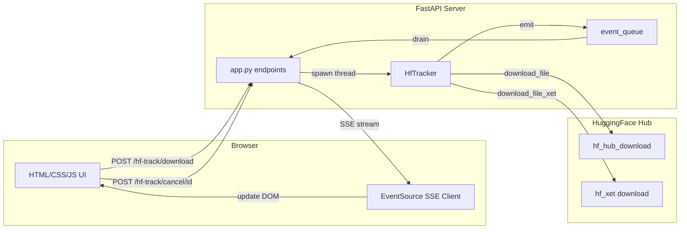

# Web App Example: Real-Time Download Progress

A self-contained web application demonstrating how to integrate **hf-track** into a FastAPI web app with real-time progress bars powered by Server-Sent Events (SSE).

## Quick Start

```bash
# Install dependencies
pip install -r requirements.txt

# Run the server
python app.py

# Open in browser
# http://localhost:8000
```

## Architecture



## How It Works

1. **User enters repo_id + filename** in the form and clicks "Start Download"
2. **Frontend** sends `POST /hf-track/download?repo_id=...&filename=...`
3. **Backend** creates a `transfer_id`, starts the download in a background thread, returns the ID
4. **Frontend** opens an `EventSource` connection to `GET /hf-track/events/{transfer_id}`
5. **Backend** drains `HfTracker.event_queue` and streams matching events as SSE
6. **Frontend** parses each SSE event and updates the progress bar, speed, ETA
7. **On completion/error/cancel**, the SSE stream closes and the card moves to history

## API Endpoints

| Method | Path | Description |
|--------|------|-------------|
| `POST` | `/hf-track/download` | Start a file download (params: `repo_id`, `filename`, `repo_type`) |
| `POST` | `/hf-track/upload` | Start a file upload (params: `repo_id`, `file_path`, `path_in_repo`, `repo_type`) |
| `POST` | `/hf-track/cancel/{transfer_id}` | Cancel a running transfer |
| `GET` | `/hf-track/events/{transfer_id}` | SSE stream for a transfer's progress events |
| `GET` | `/hf-track/status` | List active transfers and queue size |
| `DELETE` | `/hf-track/transfer/{transfer_id}` | Clear transfer state from memory |

## File Structure

```
web_app/
├── app.py              # FastAPI application — mounts router, serves static files
├── requirements.txt    # Dependencies: fastapi, uvicorn, sse-starlette, hf-track
├── static/
│   ├── index.html      # Single-page UI with progress bars and controls
│   ├── style.css       # Dark theme with animated color-coded progress bars
│   └── app.js          # Frontend logic — EventSource, DOM updates, fetch API
├── tests/
│   ├── test_web_app.py       # Integration tests (FastAPI TestClient)
│   ├── test_format_utils.py  # Formatting function tests (Python reference)
│   └── format_utils.py       # Python reference implementations of JS formatters
└── README.md           # This file
```

## Customization

### Adding Authentication

Add FastAPI dependency-based authentication to individual endpoints:

```python
from fastapi import Depends, Request
from fastapi.security import OAuth2PasswordBearer

oauth2_scheme = OAuth2PasswordBearer(tokenUrl="token")

async def verify_token(token: str = Depends(oauth2_scheme)):
    # Validate token here
    return token

@app.post("/hf-track/download", dependencies=[Depends(verify_token)])
async def start_download(repo_id: str, filename: str, repo_type: str = "model"):
    ...
```

### Adding Upload Support

The frontend currently only supports downloads. To add uploads, add a form with `file_path` input and call:

```javascript
const resp = await fetch(
    `/hf-track/upload?repo_id=${repoId}&file_path=${filePath}`,
    { method: "POST" }
);
```

### Changing the Theme

Edit `static/style.css` — modify the CSS custom properties at the top:

```css
:root {
    --bg-primary: #1a1a2e;    /* Main background */
    --accent-blue: #4cc9f0;   /* Running progress bar */
    --accent-green: #06d6a0;  /* Completed progress bar */
    --accent-red: #ef476f;    /* Error progress bar */
    --accent-yellow: #ffd166; /* Cancelled progress bar */
}
```

## Development

### Running Tests

```bash
# From the hf_track/ project root
cd hf_track
python -m pytest examples/web_app/tests/ -x -q

# Or run just the format utility tests
python -m pytest examples/web_app/tests/test_format_utils.py -x -q
```

### Running the Main Test Suite

```bash
cd hf_track
python -m pytest tests/ -x -q
```
