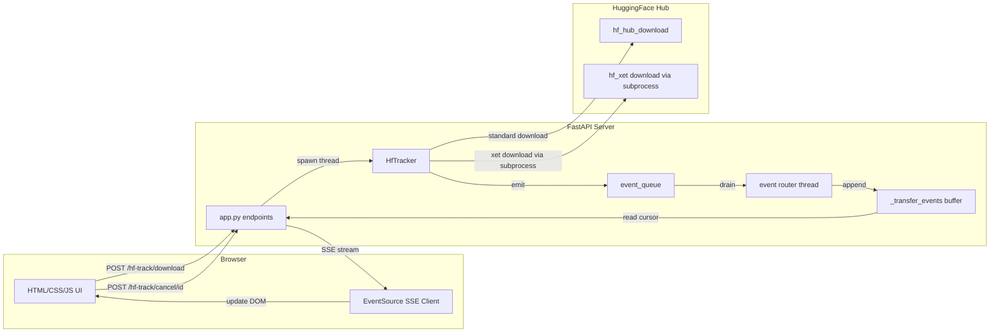

# Web App Example: Real-Time Download Progress

A self-contained web application demonstrating how to integrate **hf-track** into a FastAPI web app with real-time progress bars powered by Server-Sent Events (SSE).

## Quick Start

```bash
# Install dependencies
pip install -r requirements.txt

# Run the server
python app.py

# Open in browser
# http://localhost:8000
```

## Architecture



## How It Works

1. **User enters repo_id + filename** in the form and clicks "Start Download"
2. **Frontend** sends `POST /hf-track/download?repo_id=...&filename=...&use_xet=...`
3. **Backend** creates a `transfer_id`, starts the download in a background thread, returns the ID
4. **Frontend** opens an `EventSource` connection to `GET /hf-track/events/{transfer_id}`
5. **Event router thread** drains `HfTracker.event_queue` and routes events to per-transfer buffers
6. **SSE endpoint** reads from the per-transfer buffer and streams matching events to the client
7. **Frontend** parses each SSE event and updates the progress bar, speed, ETA
8. **On completion/error/cancel**, the SSE stream closes and the card moves to history

### Xet Toggle

The **Use Xet** checkbox controls whether Xet storage is used for downloads:

- **Checked (default)**: Xet is used if available. Downloads via `hf_xet` run in an isolated subprocess (`XetSubprocessRunner`) for Ctrl+C safety and clean cancellation.
- **Unchecked**: Sets `HF_HUB_DISABLE_XET=1` so `huggingface_hub` routes downloads through standard HTTP instead of Xet.

This matches the approach used by the CLI examples (`download_file.py`, `download_repo.py`).

> **Note**: `HF_HUB_DISABLE_XET` is a process-wide environment variable. Concurrent downloads with different `use_xet` settings may interfere. For a production app, use separate processes or a queue-based architecture.

## API Endpoints

| Method | Path | Description |
|--------|------|-------------|
| `POST` | `/hf-track/download` | Start a download (params: `repo_id`, `filename`, `local_dir`, `use_xet`, `repo_type`, `allow_patterns`) |
| `POST` | `/hf-track/cancel/{transfer_id}` | Cancel a running transfer |
| `GET` | `/hf-track/events/{transfer_id}` | SSE stream for a transfer's progress events |
| `GET` | `/hf-track/status` | List active transfers and queue size |
| `DELETE` | `/hf-track/transfer/{transfer_id}` | Clear transfer state from memory |

### Download Parameters

| Parameter | Type | Default | Description |
|-----------|------|---------|-------------|
| `repo_id` | string | *required* | HuggingFace repository ID (e.g. `bert-base-uncased`) |
| `filename` | string | `None` | Single file to download. Omit for full repo snapshot. |
| `local_dir` | string | `None` | Local directory to save files. Defaults to HF cache. |
| `use_xet` | bool | `true` | Enable/disable Xet storage for downloads. |
| `repo_type` | string | `"model"` | Repository type: `model`, `dataset`, or `space`. |
| `allow_patterns` | string | `None` | Glob pattern to filter files in snapshot download (e.g. `*.safetensors`). |

## File Structure

```
web_app/
├── app.py              # FastAPI application — endpoints, event router, workers
├── requirements.txt    # Dependencies: fastapi, uvicorn, sse-starlette, hf-track
├── static/
│   ├── index.html      # Single-page UI with progress bars and controls
│   ├── style.css       # Dark theme with animated color-coded progress bars
│   └── app.js          # Frontend logic — EventSource, DOM updates, fetch API
├── tests/
│   ├── test_web_app.py # Integration + unit tests (FastAPI TestClient + mocks)
│   ├── test_format_utils.py # Formatting function tests (Python reference)
│   └── format_utils.py # Python reference implementations of JS formatters
└── README.md           # This file
```

## Customization

### Adding Authentication

Add FastAPI dependency-based authentication to individual endpoints:

```python
from fastapi import Depends, Request
from fastapi.security import OAuth2PasswordBearer

oauth2_scheme = OAuth2PasswordBearer(tokenUrl="token")

async def verify_token(token: str = Depends(oauth2_scheme)):
    # Validate token here
    return token

@app.post("/hf-track/download", dependencies=[Depends(verify_token)])
async def start_download(repo_id: str, filename: str, repo_type: str = "model"):
    ...
```

### Changing the Theme

Edit `static/style.css` — modify the CSS custom properties at the top:

```css
:root {
    --bg-primary: #1a1a2e; /* Main background */
    --accent-blue: #4cc9f0; /* Running progress bar */
    --accent-green: #06d6a0; /* Completed progress bar */
    --accent-red: #ef476f; /* Error progress bar */
    --accent-yellow: #ffd166; /* Cancelled progress bar */
}
```

## Development

### Running Tests

```bash
# From the hf_track/ project root
cd hf_track
python -m pytest examples/web_app/tests/ -x -q

# Or run just the format utility tests
python -m pytest examples/web_app/tests/test_format_utils.py -x -q
```

### Running the Main Test Suite

```bash
cd hf_track
python -m pytest tests/ -x -q
```
